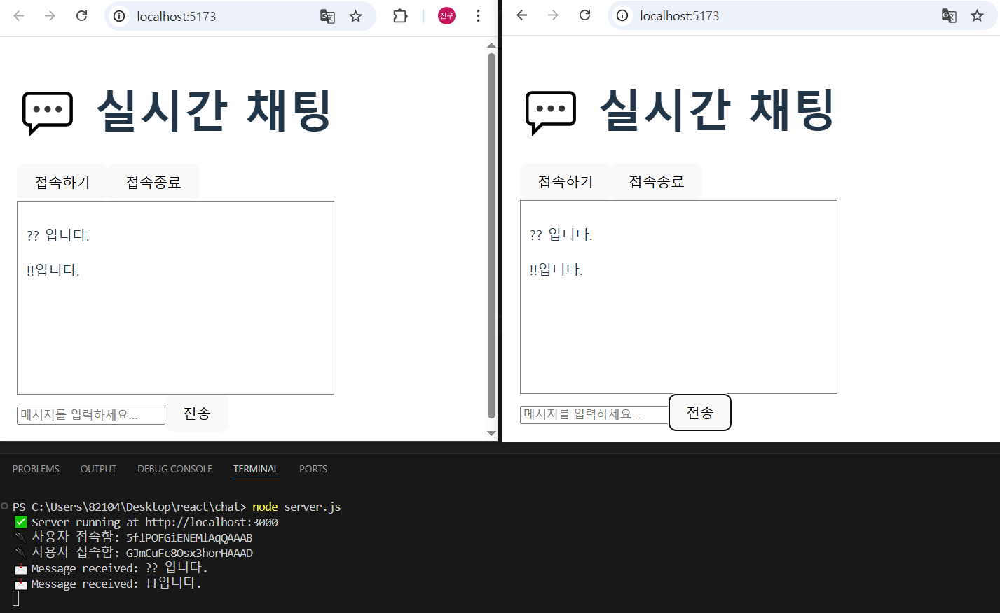
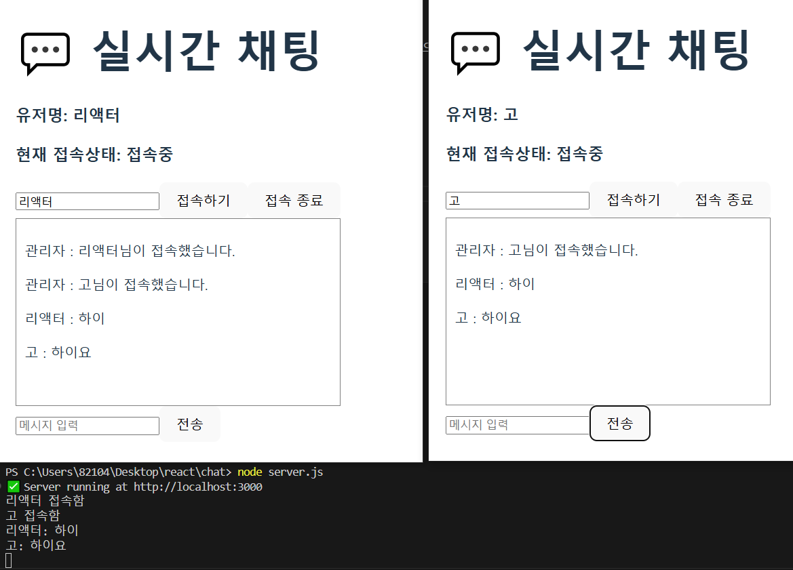

## 계획수립 

react(프런트) & express서버 socket.io 이용한 오픈채팅 만들기  
(Axios는 rest API > CRUD 이고 Socket.IO는 실시간 양방향 데이터 전송)  

1. 프로젝트 생성(node.js , vite, PWA)
2. 채팅연결 테스트 (서버, 클라이언트)
3. 클라이언트 작업
4. user 이름 받기
5. UI/UX 디자인(5.5 서버 go서버로 전환)
6. 배포

---
## Socket.IO with Express
Socket.IO 설치
```bash
npm install socket.io
```
Express 설치
```bash
npm install express
```
vite+Express 설치(프런트와 벡 동시 실행)
```bash
npm i vite-express
```

cors 설치(두개의 포트를 나눠서 실행)
```bash
npm i cors
```
server.js   
우리는 package.json "type": "module" 임으로 ES modules 방식으로   


<strong>각 docs를 확인할 것</strong>  

## 서버 클라이언트 지금까지 구현 현황


## 유저이름 지금까지 구현 현황


## tailwind 스타일 구현
[tailwind using-vite 공식 사이트 참고](https://tailwindcss.com/docs/installation/using-vite)
기존의 방식과 달라져서 애좀 먹었다.  
공식 문서를 찾아보니 tailwindcss/vite 라이브러리를 추가해서 다운하더라.(간편해짐)  
Tailwind CSS IntelliSense 라는 확장툴도 있어 사용 간편해짐 

### 최종스타일


## 서버 GOlang으로