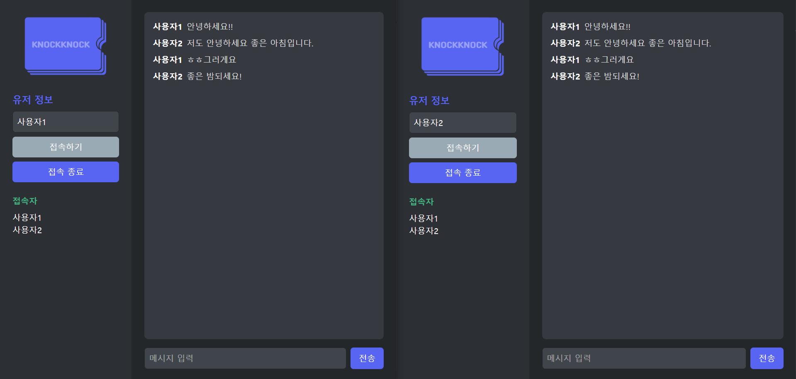

## 계획수립 

react(프런트) & express서버 socket.io 이용한 오픈채팅 만들기  
(Axios는 rest API > CRUD 이고 Socket.IO는 실시간 양방향 데이터 전송)  

1. 프로젝트 생성(node.js , vite, PWA)
2. 채팅연결 테스트 (서버, 클라이언트)
3. 클라이언트 작업
4. user 이름 받기
5. UI/UX 디자인(5.5 서버 go서버로 전환)
6. 배포

---
## Socket.IO with Express
Socket.IO 설치
```bash
npm install socket.io
```
Express 설치
```bash
npm install express
```
vite+Express 설치(프런트와 벡 동시 실행)
```bash
npm i vite-express
```

cors 설치(두개의 포트를 나눠서 실행)
```bash
npm i cors
```
server.js   
우리는 package.json "type": "module" 임으로 ES modules 방식으로   


<strong>각 docs를 확인할 것</strong>  

## 서버 클라이언트 지금까지 구현 현황


## 유저이름 지금까지 구현 현황


## tailwind 스타일 구현
[tailwind using-vite 공식 사이트 참고](https://tailwindcss.com/docs/installation/using-vite)
기존의 방식과 달라져서 애좀 먹었다.  
공식 문서를 찾아보니 tailwindcss/vite 라이브러리를 추가해서 다운하더라.(간편해짐)  
Tailwind CSS IntelliSense 라는 확장툴도 있어 사용 간편해짐   

### 스타일 1차 수정
  

### 최종스타일
  

## 서버 GOlang으로
server폴더 만들고 [go설치](https://go.dev/dl/)  
```bash
cd server
go mod init go-chat-server
go get -u github.com/gin-gonic/gin
go get -u github.com/gorilla/websocket
```
go 모듈 초기화 및 라이브러리 설치 후 go서버 react랑 연결  

벡엔드 서버 실행 명령
```bash
cd go-chat-server
go run server.go
```
프런트엔드 실행 명령  
```bash
cd ..
npm run dev
```

### 주요변경점


### 요약


### 마무리



## 배포  
 render.com으로 배포할 생각이다.  
 
 1. gitgub 연결
 2. 배포할 repo 선택
 3. 프런트, 벡 나눠서 배포  

[배포링크](https://chat-front-1f2j.onrender.com)

### 오류나 에러처리 모음
1. render 로 배포후 백엔드 서버 건드릴때 프런트에 소켓으로 연결된 부분을 render 주소, local 주소 구별
2. 접속종료시 users 배열 변경되고 재랜더링 구현 했으나 오작동